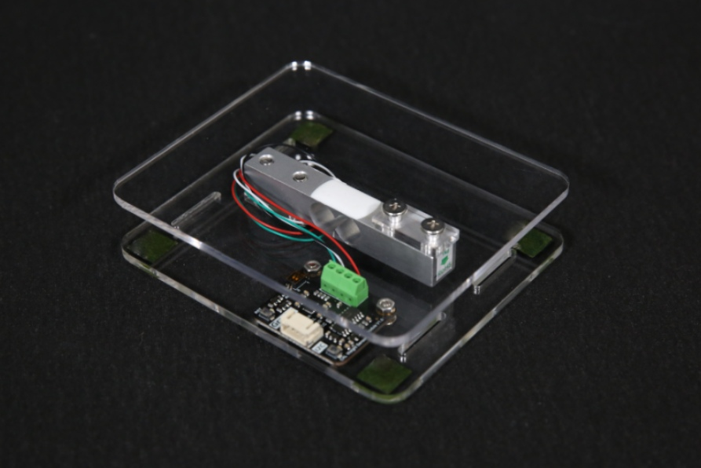

# DFRobot_BT401
- [English Version](./README.md)

HX711是一款为高精度电子秤设计的24位a / D转换芯片。
本示例适用于HX711传感器，通过Arduino读取数据。




## 产品链接 (https://www.dfrobot.com.cn/goods-3128.html)
     KIT0176: I2C 1Kg Weight Sensor Kit - HX711
	 
## 目录

  * [概述](#概述)
  * [库安装](#库安装)
  * [方法](#方法)
  * [兼容性](#兼容性)
  * [历史](#历史)
  * [创作者](#创作者)
## 概述
提供一个Arduino库，通过从HX711读取数据来获得质量。

## 库安装

To use this library, first download the library file, paste it into the \Arduino\libraries directory, then open the examples folder and run the demo in the folder.

## 方法
```python
   def begin(self):
  '''!
    @fn begin
    @brief 初始化
    @return 1(初始化成功)
  '''
  
  def read_weight(self,times):
  '''!
    @fn read_weight
    @brief 获取称上面的物体的重量
    @param times 次数(多此测量取平均值)
    @return 物体重量, 单位: g
  '''
  
  def get_calibration(self):
  '''!
    @fn get_calibration
    @brief 获取校准值 
    @return 返回校准值
  '''


  def set_calibration(self ,value):
  '''!
    @fn set_calibration
    @brief 设置校准值
    @param value 校准值
  '''

  def peel_flag(self):
  '''
    @fn peel_flag
    @brief 获取校准是否完成信号
    @return 结果
    @retval true 完成
    @retval false 未完成
  '''
  
  def set_cal_weight(self,triWeight):
  '''!
    @fn set_cal_weight
    @brief 重量传感器模块自动校准时设置校准重量(g)
    @param triWeight   重量值
  '''
  
  def set_threshold(self,threshold):
  '''!
    @fn set_threshold
    @brief 设置自动触发校准的阈值
    @param threshold 阈值
  '''

  def peel(self):
  '''!
    @fn peel
    @brief 去皮
  '''
  
  def enable_cal(self):
  '''!
    @fn enable_cal
    @brief 开始传感器校准
  '''

  def get_cal_flag(self):
  '''!
    @fn get_cal_flag
    @brief Wait for sensor calibration to complete
    @return Result 
    @retval true The calibration completed
    @retval false The calibration is not complete
  '''
```

## 兼容性

| 主板         | 通过 | 未通过 | 未测试 | 备注 |
| ------------ | :--: | :----: | :----: | :--: |
| RaspberryPi2 |      |        |   √    |      |
| RaspberryPi3 |      |        |   √    |      |
| RaspberryPi4 |  √   |        |        |      |

* Python 版本

| Python  | 通过 | 未通过 | 未测试 | 备注 |
| ------- | :--: | :----: | :----: | ---- |
| Python2 |  √   |        |        |      |
| Python3 |  √   |        |        |      |

## 历史

- 2020/12/31 - Version 1.0.0 released.

## 创作者

Written by fengli(li.feng@dfrobot.com), 2020.12.31 (Welcome to our [website](https://www.dfrobot.com/))
